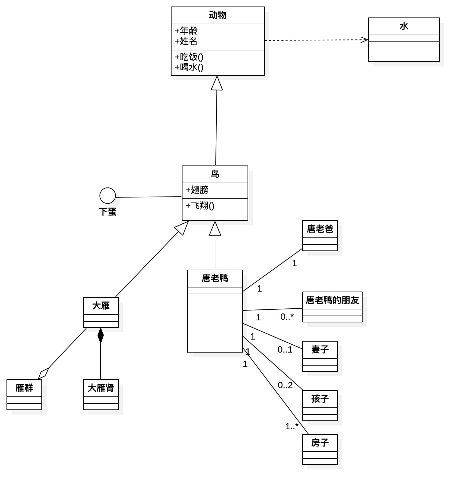
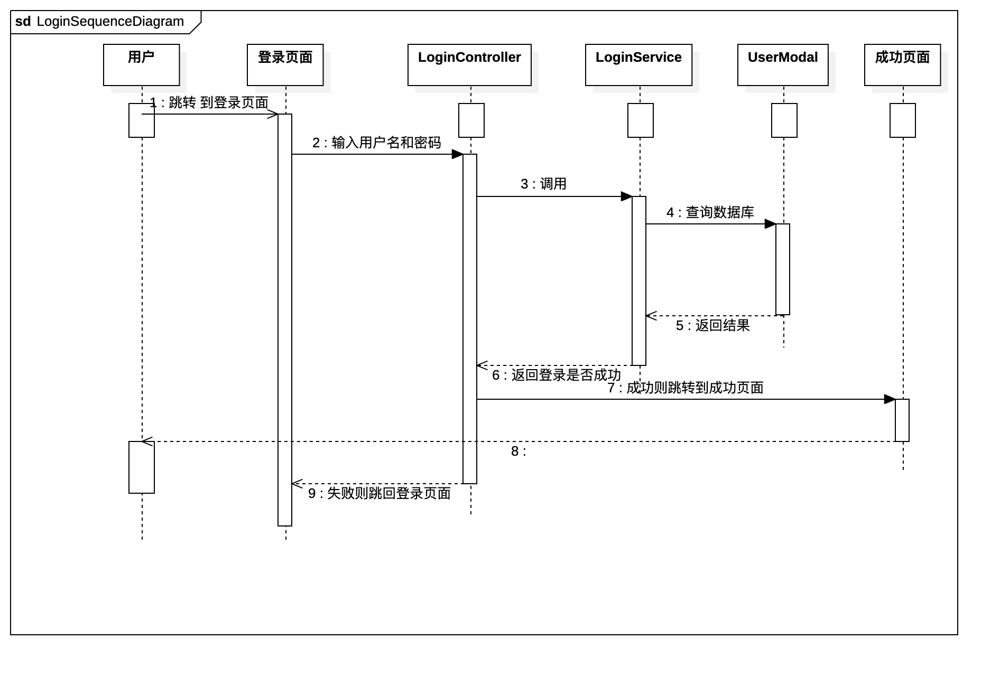
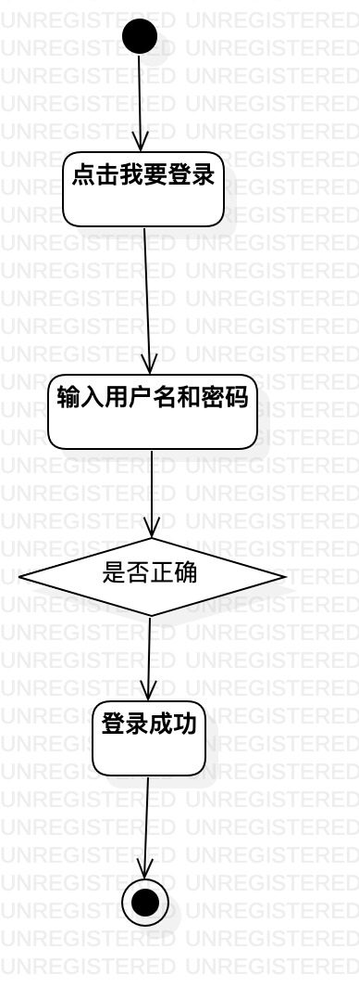

[](https://github.com/yanyunchangfeng/learn-design-patterns/actions/workflows/test.yml/?query=branch:main) [](https://codecov.io/gh/yanyunchangfeng/learn-design-patterns) [](https://github.com/yanyunchangfeng/webpack-ts-template/actions/workflows/deploy.yml)

[](https://www.npmjs.com/package/learn-design-patterns)

<p align="center">
    
</p>

## 介绍

你好，我是[燕云长风](https://yanyunchangfeng.github.io)。  
寓意：结合李白著名的边塞诗《关山月》取【燕云长风】—— 长风几万里，吹度玉门关。

## 设计模式

- [类图](src/app/class1/index.ts) 
- [时序图/活动(流程)图](src/app/sequence2/index.ts)  
- [面向对象-抽象](src/app/pod3/abstract.ts) | [面向对象-封装](src/app/pod3/encapsulation.ts) | [面向对象-继承](src/app/pod3/inherit.ts) | [面向对象-多态](src/app/pod3/polymorphic.ts)
- [设计原则](src/app/pod3/designPrinciple.ts) | [开闭原则-原始](src/app/pod3/openclose.ts) | [开闭原则-案例 1](src/app/pod3/openclose1.ts) | [开闭原则-案例 2](src/app/pod3/openclose2.ts) | [单一职责原则](src/app/pod3/singlePrinciple.ts) | [里氏替换原则-案例 1](src/app/pod3/sub.ts) | [里氏替换原则-案例 2](src/app/pod3/sub1.ts) | [设计原则-依赖倒置原则案例 1](src/app/pod3/dependencyInversion.ts) | [设计原则-依赖倒置原则案例 2](src/app/pod3/dependencyInversion1.ts) | [设计原则-接口隔离原则](src/app/pod3/interfaceSegregation.ts) | [迪米特法则](src/app/pod3/lod.ts) | [合成复用原则](src/app/pod3/11.ts)
- [工厂模式](src/app/factory4/index.ts) | [简单工厂](src/app/factory4/simple.ts) | [Jquery 简单工厂](src/app/factory4/jquery.ts) | [工厂方法](src/app/factory4/method.ts) | [抽象工厂模式](src/app/factory4/abstract.ts)
- [单例模式](src/app/single5/index.ts) | [es5 实现单例](src/app/single5/2.ts) | [透明单例](src/app/single5/3.ts) | [单例与构建过程分离](src/app/single5/4.ts) | [单例封装变化](src/app/single5/5.ts)
- [适配器模式](src/app/adapter6/index.ts) | [适配器例子 axios](src/app/adapter6/axios.ts) | [适配器例子 toAxiosAdaptor](src/app/adapter6/toAxiosAdaptor.ts) | [适配器例子 treeFlattenAdaptor](src/app/adapter6/6.html) | [适配器例子 arrToTreeAdaptor](src/app/adapter6/toTreeAdaptor.ts)
- [装饰器模式](src/app/decorator7/index.ts) | [装饰类](src/app/decorator7/2.ts) | [装饰函数](src/app/decorator7/index.html)
- [代理模式](src/app/proxy8/index.ts) | [事件委托代理](src/app/proxy8/2.html) | [虚拟代理图片预加载](src/app/proxy8/3.html) | [虚拟代理图片懒加载](src/app/proxy8/4.html) | [缓存代理](src/app/proxy8/5.ts) | [防抖节流代理](src/app/proxy8/6.html) | [正向/反向/跨域/代理](src/app/proxy8/7.ts) | [跨域代理服务端](src/app/proxy8/7.9999.ts)
- [观察者模式](src/app/observer9/index.ts) | [EventEmitter](src/app/observer9/EventEmitter.ts) | [promise](src/app/observer9/promise.ts) | [callbacks](src/app/observer9/callbacks.ts) | [fs.createReadStream](src/app/observer9/createReadStream.ts) | [http.createServer](src/app/observer9/http.ts) | [发布订阅模式](src/app/observer9/publish-subscribe.ts)
- [门面模式](src/app/facade10/index.ts) | [computer](src/app/facade10/computer.ts) | [overload](src/app/facade10/overload.ts) | [zip](src/app/facade10/zip.ts) | [buffer](src/app/facade10/buffer.ts) | [createElement](src/app/facade10/createElement.ts) | [createStore](src/app/facade10/createStore.ts)
- [迭代器模式](src/app/iterator11/index.ts) | [迭代器场景 forEach](src/app/iterator11/2.ts) | [ES6 Iterator](src/app/iterator11/3.ts) | [yield\*](src/app/iterator11/4.ts) | [二叉树遍历](src/app/iterator11/5.ts)

## 系列项目

| 名称 | 描述 |
| --- | --- |
| NiceFish（美人鱼） | 这是一个系列项目，目标是示范前后端分离的开发模式:前端浏览器、移动端、Electron 环境中的各种开发模式。后端有两个版本：SpringBoot 版本和 SpringCloud 版本，http://git.oschina.net/mumu-osc/NiceFish/ |
| NiceFish-React | 这是 React 版本，基于 React 18.2.0 ，使用 Antd、Inversify、 定制版 Bootstrap 开发。 https://gitee.com/mumu-osc/NiceFish-React |
| nicefish-ionic | 这是一个移动端的 demo，基于 ionic，此项目已支持 PWA。http://git.oschina.net/mumu-osc/nicefish-ionic |
| NiceBlogElectron | 这是一个基于 Electron 的桌面端项目，把 NiceFish 用 Electron 打包成了一个桌面端运行的程序。这是由 ZTE 中兴通讯的前端道友提供的，我 fork 了一个，有几个 node 模块的版本号老要改，如果您正在研究如何利用 Electron 开发桌面端应用，请参考这个项目，https://github.com/damoqiongqiu/NiceBlogElectron |
| OpenWMS | 用来示范管理后台型系统的最佳实践，https://gitee.com/mumu-osc/OpenWMS-Frontend |
| nicefish-springboot | 用来示范前后端分离模式下，前端代码与后端服务的对接方式，已经完成了基线版本，并且在腾讯云上面做了实际的部署。代码仓库在这里： https://gitee.com/mumu-osc/nicefish-spring-boot ，腾讯云上的演示地址在这里： http://118.25.136.164 ，以此为基础，你可以继续开发出适合自己业务场景的代码。 |
| nicefish-springcloud | 用来示范前后端分离模式下，前端代码与分布式后端服务的对接方式，即将完成，代码最近放出。 |

## 单元测试

```
   pnpm test
```

## 端到端测试

```
   pnpm run cypress:open
   pnpm run cypress:run
```

## 打包分析

```
   pnpm run build-analyzer
```

## 社交主页

- [燕云长风 github](https://github.com/yanyunchangfeng)

## 开源许可证

MIT
